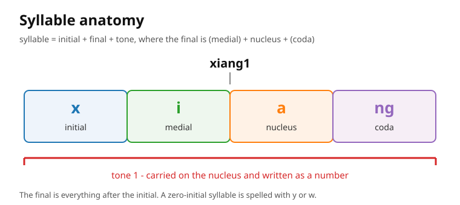

# Syllable anatomy

A Mandarin syllable has three parts: an initial, a final, and a tone. The tone is not
optional; every lexical syllable has one.



```
syllable = initial + final + tone
final    = (medial) + nucleus + (coda)
```

| Part | Role | Example in `xiang1` | Example in `hao3` |
| --- | --- | --- | --- |
| Initial | opening consonant | `x` | `h` |
| Medial | glide before the nucleus | `i` | - |
| Nucleus | main vowel, carries the tone | `a` | `a` |
| Coda | closing glide or nasal | `ng` | `o` |
| Tone | pitch contour, written as a number | `1` | `3` |

## Initial

The initial is a single consonant, or absent. A syllable without an initial is a
zero-initial syllable and is spelled with `y` or `w` when written (`yi1`, `wu3`). The
initials are listed in `initials.md`.

## Final

The final is the rest of the syllable. It may be a single vowel (`a`, `o`, `e`, `i`,
`u`, `ü`, `er`), a diphthong (`ai`, `ei`, `ao`, `ou`), or a vowel plus a nasal coda
(`an`, `en`, `ang`, `eng`, `ong`). The nucleus carries the tone. The finals are listed
in `finals.md`.

## Tone

The tone is a pitch contour on the nucleus (and, for some finals, the whole final). It is
written as a number after the syllable (ADR 0012) and may change in context through tone
sandhi (see `tone-sandhi.md`).

## Counting the parts

| Pinyin | Initial | Final | Tone |
| --- | --- | --- | --- |
| `ma1` | `m` | `a` | `1` |
| `hao3` | `h` | `ao` | `3` |
| `xiang1` | `x` | `iang` | `1` |
| `zhuang1` | `zh` | `uang` | `1` |
| `er2` | - | `er` | `2` |
| `yi1` | - (written `y`) | `i` | `1` |

## Authoring notes

- A syllable has exactly one tone; never write a multi-syllable word as one tone number.
- When teaching syllable anatomy, keep the initial / final split visible and name finals
  by their spelling (`-ng`, `-ao`), which is what pronunciation feedback uses.
- Minimal pairs for anatomy drills contrast one part at a time: initial (`zhi1` / `zi1`),
  final (`jin1` / `jing1`), or tone (`ma1` / `ma3`).
