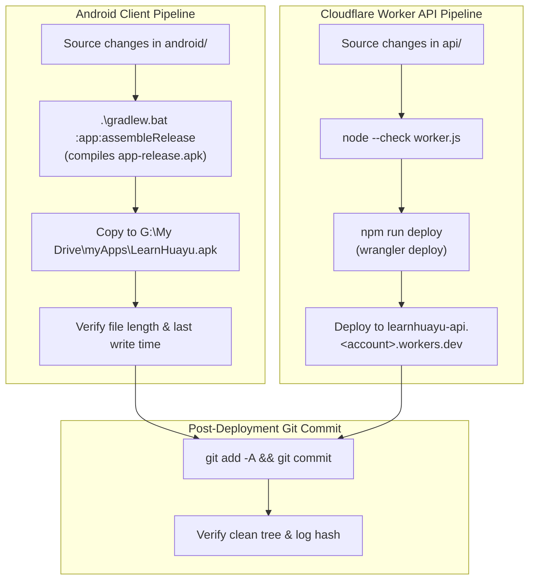

# Deployment pipeline

Status: proposed. This mirrors the structure used by the Prayer app: an Android
client pipeline, a Cloudflare Worker API pipeline, and a post-deployment commit
step. The Worker source and its `dev`/`deploy` scripts already exist in `api/`
(see `docs/02-architecture.md`); the Android project does not, and no automation
is implemented yet - the steps below are currently run manually.

## Overview

Both pipelines run independently, then converge into a single post-deployment
commit that records the released artifacts.

## Android client pipeline

| Step | Command / action | Notes |
| --- | --- | --- |
| Trigger | Changes under `android/` | Manual or CI. |
| Build | `.\gradlew.bat :app:assembleRelease` | Produces `app-release.apk`. |
| Publish | Copy APK to `G:\My Drive\myApps\LearnHuayu.apk` | Personal distribution via Drive. |
| Verify | Compare file length and `LastWriteTime` | Confirms the copy is the new build. |

Signing requires a release keystore. Never commit the keystore or its
credentials (see `.gitignore`); supply them via environment or a local
`keystore.properties` that is excluded from git.

## Cloudflare Worker API pipeline

The Worker is **required, not optional**: it proxies multimodal audio understanding
(Muse Spark), the reference-vs-attempt pronunciation comparison (ADR 0005), and
text-to-speech (Kokoro), keeping provider API keys out of the APK and enforcing rate
limits. Offline listening drills work without it; AI coaching does not.

| Step | Command / action | Notes |
| --- | --- | --- |
| Trigger | Changes under `api/` | |
| Syntax check | `node --check worker.js` | Fast failure before deploy. |
| Deploy | `npm run deploy` | Wraps `wrangler deploy`. |
| Verify | Reach `learnhuayu-api.<account>.workers.dev` | Confirm the new version is live. |

## Post-deployment commit

After both artifacts are published:

1. `git add -A && git commit`
2. Verify a clean working tree and record the resulting log hash.

Commit only release-relevant changes. Deployment secrets and build output stay
out of git.

## Open questions

- Whether to automate this with GitHub Actions or keep it a local script.
- Where release APKs should live long-term (Drive vs. GitHub Releases).
- The Worker is deployed under the name in `api/wrangler.jsonc` (currently `mandarin`),
  while this document targets `learnhuayu-api.<account>.workers.dev`. Decide the final
  Worker name and align the config and these URLs.
