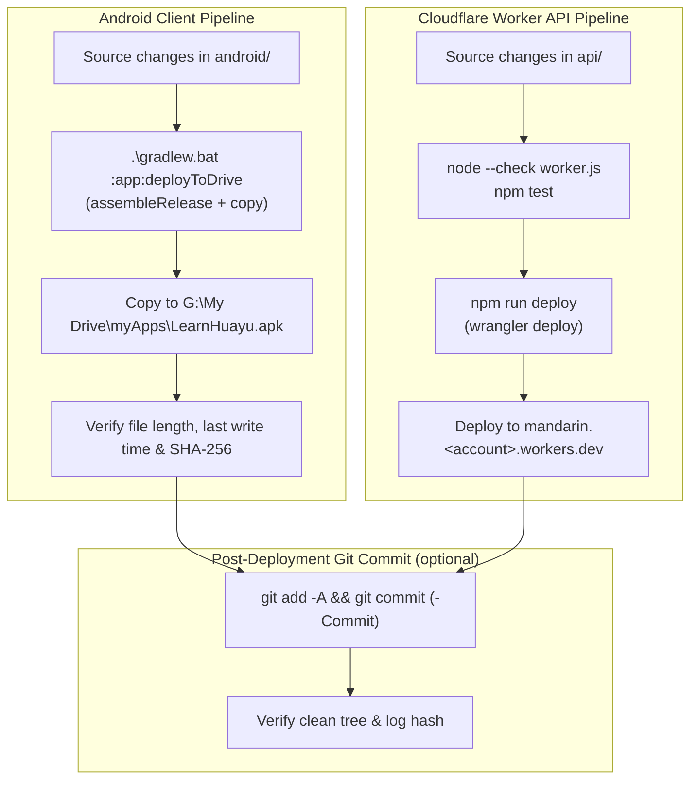

# Deployment pipeline

Status: the local pipeline is scripted in `deploy.ps1` (repository root) and the
`:app:deployToDrive` Gradle task; this document is the operating procedure.
GitHub Actions (`.github/workflows/ci.yml`) remains CI only: Android build, tests,
lint, and formatting checks run there, while releases are published from the local
machine.

## Prerequisites

- Windows with PowerShell 5.1 or later (`RemoteSigned` execution policy).
- JDK 17 and Android SDK 35; `android/local.properties` records `sdk.dir`.
- Node.js 24 for the Worker checks and `npx wrangler`.
- Cloudflare authentication for Wrangler (`npx wrangler login` once per machine).
- Google Drive for Desktop running with the `G:` mount; `G:\My Drive\myApps` must
  exist. If the mount is absent, start Google Drive for Desktop instead of
  substituting another path.

## Overview

Both pipelines run independently, then optionally converge into a post-deployment
commit (`deploy.ps1 -Commit`) that records the released artifacts.



## Local pipeline

`deploy.ps1` runs the whole pipeline from the repository root and ends with the
Google Drive deployment:

```powershell
.\deploy.ps1
```

| Switch | Effect |
| --- | --- |
| `-SkipWorker` | Skips the Cloudflare Worker deploy phase. |
| `-SkipAndroid` | Skips the Android build and Google Drive deploy phase. |
| `-DriveDir <path>` | Overrides the Google Drive destination (default `G:\My Drive\myApps`). |
| `-Commit -Message "<message>"` | Commits the released source state after deployment. |

The script fails fast when the Google Drive folder is not mounted, and it verifies
the deployed APK (non-zero length, fresh `LastWriteTime`, SHA-256) before reporting
success. The Worker phase requires authenticated `npx wrangler` (`npx wrangler
login` once per machine).

## Android client pipeline

| Step | Command / action | Notes |
| --- | --- | --- |
| Trigger | Changes under `android/` | Run via `deploy.ps1` or `.\gradlew.bat :app:deployToDrive` from `android/`. |
| Build | `:app:deployToDrive` depends on `:app:assembleRelease` | Produces `app-release.apk`. |
| Publish | Copy APK to `G:\My Drive\myApps\LearnHuayu.apk` | Personal distribution via Drive; `-PdriveDir=<path>` overrides the folder. |
| Verify | Compare file length, `LastWriteTime`, and SHA-256 | The task fails when the copy is missing or empty; `deploy.ps1` also rejects a stale file. |

The release build is signed so it can be sideloaded. When `android/keystore.properties`
exists, it supplies the release keystore (`storeFile`, `storePassword`, `keyAlias`,
`keyPassword`); otherwise the debug keystore signs the release build. Never commit the
keystore or `keystore.properties` (see `.gitignore`); supply them only through the local,
git-ignored properties file.

### Manual fallback

1. From `android/`: `.\gradlew.bat :app:assembleRelease`
2. Copy `android/app/build/outputs/apk/release/app-release.apk` to
   `G:\My Drive\myApps\LearnHuayu.apk`, overwriting the previous release.
3. Verify with `Get-Item -LiteralPath "G:\My Drive\myApps\LearnHuayu.apk"`: non-zero
   `Length` and a fresh `LastWriteTime`.

### Play Store internal testing track

The Drive APK above is the sideloading path. For the Play Store internal testing track the
author uploads an App Bundle instead, and Play re-signs the delivered artifact:

1. Build the bundle from `android/`: `.\gradlew.bat :app:bundleRelease`, producing
   `android/app/build/outputs/bundle/release/app-release.aab`. The same signing rules as the
   APK apply (`android/keystore.properties` when present, otherwise the debug keystore).
2. In the Play Console, enable Play App Signing and upload the `.aab` to the internal
   testing track, then add the author's account as a tester.
3. Set the version code and name before each upload; both come from the Gradle version
   properties, so a release is a code change plus a rebuild.
4. Internal testing is author-driven; GitHub Actions stays CI only and never holds the
   upload key.

## Cloudflare Worker API pipeline

The Worker is **required, not optional**: it proxies multimodal audio understanding
(Muse Spark), the reference-vs-attempt pronunciation comparison (ADR 0005), and
text-to-speech (Kokoro), keeping provider API keys out of the APK and enforcing rate
limits. Offline listening drills work without it; AI coaching does not.

| Step | Command / action | Notes |
| --- | --- | --- |
| Trigger | Changes under `api/` | Run via `deploy.ps1` or manually. |
| Syntax check | `node --check worker.js` | Fast failure before deploy. |
| Tests | `npm test` | Offline `node:test` suite. |
| Deploy | `npm run deploy` | Wraps `wrangler deploy`. |
| Verify | Reach `mandarin.<account>.workers.dev` | Confirm the new version is live; Wrangler prints the URL and version ID. |

### Manual fallback

```powershell
Set-Location api
node --check worker.js
npm test
npm run deploy
```

## Post-deployment commit

After both artifacts are published, `deploy.ps1 -Commit -Message "<message>"`:

1. `git add -A && git commit`
2. Verify a clean working tree and record the resulting log hash.

Commit only release-relevant changes. Deployment secrets and build output stay
out of git.

## Open questions

- Where release APKs should live long-term (Drive vs. GitHub Releases).
- The Worker deploys under the name in `api/wrangler.jsonc` (`mandarin`), so its URL is
  `mandarin.<account>.workers.dev`; the health check still reports the service label
  `learnhuayu-api`. Renaming the Worker later means updating the config and these URLs
  together.
